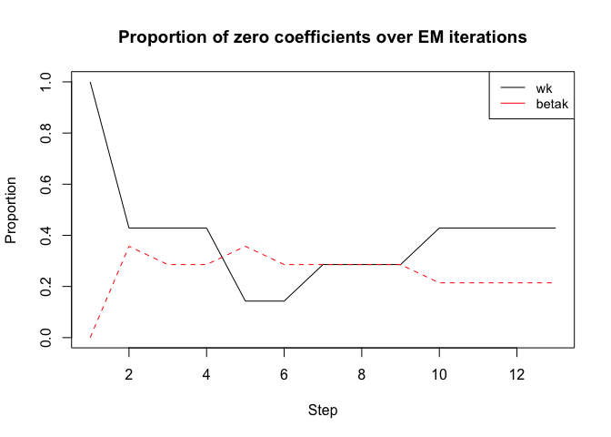
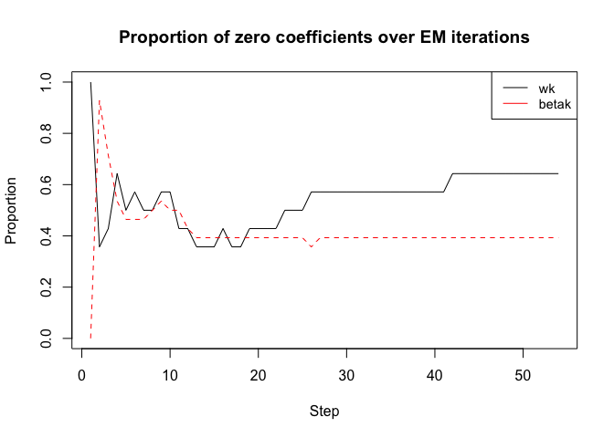
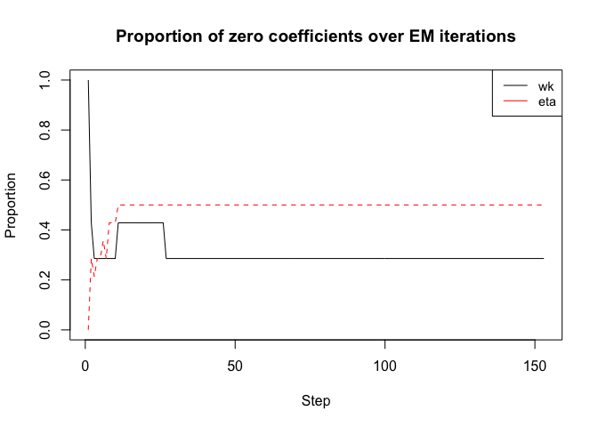
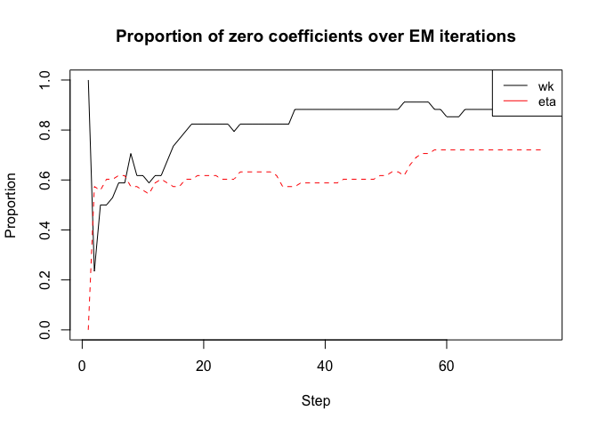
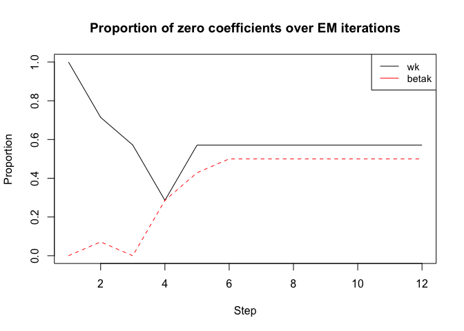
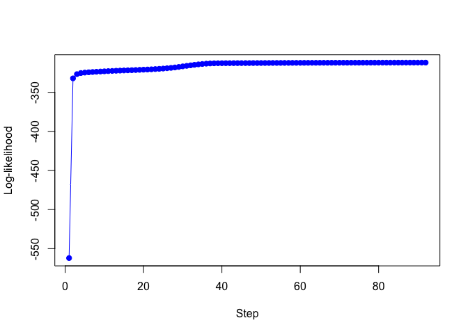
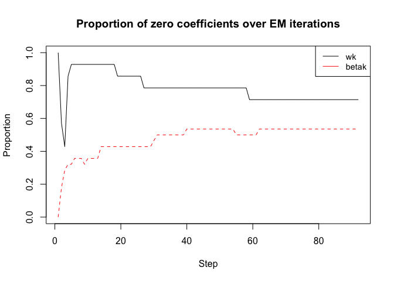

<!-- README.md is generated from README.Rmd. Please edit that file -->

# **RMoE**: LASSO Regularized Mixture of Experts Models

<!-- badges: start -->

<!-- badges: end -->

R Toolbox to run the algorithms and to produce the results presented in
the submitted paper:

*Estimation and Feature Selection in Mixtures of Generalized Linear
Experts Models.* Ref: arXiv:1907.06994, July, 2019 by Tuyen Huynh and
Faicel Chamroukhi. Please cite the paper and the toolbox when using the
code.

This package has three main functions:

  - *GaussRMoE*: To fit Gaussian Regularized Mixture-of-Experts;
  - *LogisticRMoE*: To fit Logistic Regularized Mixture-of-Experts;
  - *PoissonRMoE*: To fit Poisson Regularized Mixture-of-Experts.

# Installation

You can install **RMoE** package from
[GitHub](https://github.com/fchamroukhi/HDME) with:

``` r
# install.packages("devtools")
devtools::install_github("fchamroukhi/HDME")
```

To build *vignettes* for examples of usage, type the command below
instead:

``` r
# install.packages("devtools")
devtools::install_github("fchamroukhi/HDME", 
                         build_opts = c("--no-resave-data", "--no-manual"), 
                         build_vignettes = TRUE)
```

Use the following command to display vignettes:

``` r
browseVignettes("RMoE")
```

# Usage

``` r
library(RMoE)
```

<details>

<summary>Gaussian Regularized Mixture-of-Experts</summary>

``` r
# Application to a simulated data set

data("gaussian")
X <- as.matrix(gaussian[, -8])
y <- gaussian$V8

K <- 2 # Number of experts
Lambda <- 5
Gamma <- 5
opt <- FALSE # opt = FALSE: proximal Newton; opt = TRUE: proximal Newton-type

grmoe <- GaussRMoE(Xm = X, Ym = y, K = K, Lambda = Lambda, 
                   Gamma = Gamma, option = opt, verbose = TRUE)
#> EM - GRMoE: Iteration: 1 | log-likelihood: -1117.02
#> EM - GRMoE: Iteration: 2 | log-likelihood: -619.861410143135
#> EM - GRMoE: Iteration: 3 | log-likelihood: -598.424977891145
#> EM - GRMoE: Iteration: 4 | log-likelihood: -586.957818929492
#> EM - GRMoE: Iteration: 5 | log-likelihood: -571.440033979336
#> EM - GRMoE: Iteration: 6 | log-likelihood: -557.710221927643
#> EM - GRMoE: Iteration: 7 | log-likelihood: -550.013138559108
#> EM - GRMoE: Iteration: 8 | log-likelihood: -547.366243372975
#> EM - GRMoE: Iteration: 9 | log-likelihood: -546.674160272791
#> EM - GRMoE: Iteration: 10 | log-likelihood: -546.499905531508
#> EM - GRMoE: Iteration: 11 | log-likelihood: -546.452368849434
#> EM - GRMoE: Iteration: 12 | log-likelihood: -546.437963318026
#> EM - GRMoE: Iteration: 13 | log-likelihood: -546.433091264981

grmoe$plot()
```



``` r
# Application to a real data set

data("housing")
X <- as.matrix(housing[, -15])
y <- housing$V15

K <- 2 # Number of experts
Lambda <- 42
Gamma <- 10
opt <- FALSE # opt = FALSE: proximal Newton; opt = TRUE: proximal Newton-type

grmoe <- GaussRMoE(Xm = X, Ym = y, K = K, Lambda = Lambda, 
                   Gamma = Gamma, option = opt, verbose = TRUE)
#> EM - GRMoE: Iteration: 1 | log-likelihood: -5318.92
#> EM - GRMoE: Iteration: 2 | log-likelihood: -749.217719726628
#> EM - GRMoE: Iteration: 3 | log-likelihood: -492.035360486426
#> EM - GRMoE: Iteration: 4 | log-likelihood: -446.370208731919
#> EM - GRMoE: Iteration: 5 | log-likelihood: -435.625923454457
#> EM - GRMoE: Iteration: 6 | log-likelihood: -430.57998444443
#> EM - GRMoE: Iteration: 7 | log-likelihood: -426.857364593801
#> EM - GRMoE: Iteration: 8 | log-likelihood: -423.151927211015
#> EM - GRMoE: Iteration: 9 | log-likelihood: -419.027730728067
#> EM - GRMoE: Iteration: 10 | log-likelihood: -413.854066373251
#> EM - GRMoE: Iteration: 11 | log-likelihood: -409.345427450602
#> EM - GRMoE: Iteration: 12 | log-likelihood: -405.678040971862
#> EM - GRMoE: Iteration: 13 | log-likelihood: -402.43258352187
#> EM - GRMoE: Iteration: 14 | log-likelihood: -399.338921506234
#> EM - GRMoE: Iteration: 15 | log-likelihood: -396.379723577069
#> EM - GRMoE: Iteration: 16 | log-likelihood: -393.624206419239
#> EM - GRMoE: Iteration: 17 | log-likelihood: -391.180387033187
#> EM - GRMoE: Iteration: 18 | log-likelihood: -389.111802437645
#> EM - GRMoE: Iteration: 19 | log-likelihood: -387.535754483338
#> EM - GRMoE: Iteration: 20 | log-likelihood: -386.405945490617
#> EM - GRMoE: Iteration: 21 | log-likelihood: -385.606579601175
#> EM - GRMoE: Iteration: 22 | log-likelihood: -385.019124748163
#> EM - GRMoE: Iteration: 23 | log-likelihood: -384.598477503821
#> EM - GRMoE: Iteration: 24 | log-likelihood: -384.258853477392
#> EM - GRMoE: Iteration: 25 | log-likelihood: -383.672832174018
#> EM - GRMoE: Iteration: 26 | log-likelihood: -379.523861049129
#> EM - GRMoE: Iteration: 27 | log-likelihood: -375.210712564445
#> EM - GRMoE: Iteration: 28 | log-likelihood: -374.362003706708
#> EM - GRMoE: Iteration: 29 | log-likelihood: -373.905484000266
#> EM - GRMoE: Iteration: 30 | log-likelihood: -373.5878891405
#> EM - GRMoE: Iteration: 31 | log-likelihood: -373.337536571124
#> EM - GRMoE: Iteration: 32 | log-likelihood: -373.126784375524
#> EM - GRMoE: Iteration: 33 | log-likelihood: -372.942518847827
#> EM - GRMoE: Iteration: 34 | log-likelihood: -372.777551734593
#> EM - GRMoE: Iteration: 35 | log-likelihood: -372.627765951385
#> EM - GRMoE: Iteration: 36 | log-likelihood: -372.490500063181
#> EM - GRMoE: Iteration: 37 | log-likelihood: -372.364252106794
#> EM - GRMoE: Iteration: 38 | log-likelihood: -372.248031273283
#> EM - GRMoE: Iteration: 39 | log-likelihood: -372.141215708944
#> EM - GRMoE: Iteration: 40 | log-likelihood: -372.043444839423
#> EM - GRMoE: Iteration: 41 | log-likelihood: -371.954542322469
#> EM - GRMoE: Iteration: 42 | log-likelihood: -371.886520879306
#> EM - GRMoE: Iteration: 43 | log-likelihood: -371.841195648488
#> EM - GRMoE: Iteration: 44 | log-likelihood: -371.807139345355
#> EM - GRMoE: Iteration: 45 | log-likelihood: -371.780594545755
#> EM - GRMoE: Iteration: 46 | log-likelihood: -371.759625826461
#> EM - GRMoE: Iteration: 47 | log-likelihood: -371.742952111909
#> EM - GRMoE: Iteration: 48 | log-likelihood: -371.729653121673
#> EM - GRMoE: Iteration: 49 | log-likelihood: -371.719057538292
#> EM - GRMoE: Iteration: 50 | log-likelihood: -371.710583972124
#> EM - GRMoE: Iteration: 51 | log-likelihood: -371.703815084085
#> EM - GRMoE: Iteration: 52 | log-likelihood: -371.698386848288
#> EM - GRMoE: Iteration: 53 | log-likelihood: -371.694047195118
#> EM - GRMoE: Iteration: 54 | log-likelihood: -371.69056033896

grmoe$plot()
```



</details>

<details>

<summary>Logistic Regularized Mixture-of-Experts</summary>

``` r
# Application to a simulated data set

data("logistic")
X <- as.matrix(logistic[, -8])
y <- logistic$V8

K <- 2 # Number of experts
Lambda <- 3
Gamma <- 3
opt <- FALSE # opt = FALSE: proximal Newton; opt = TRUE: proximal Newton-type

lrmoe <- LogisticRMoE(Xmat = X, Ymat = y, K = K, Lambda = Lambda, 
                   Gamma = Gamma, option = opt, verbose = TRUE)
#> EM - LRMoE: Iteration: 1 | log-likelihood: -364.56
#> EM - LRMoE: Iteration: 2 | log-likelihood: -214.548431280591
#> EM - LRMoE: Iteration: 3 | log-likelihood: -205.613994128018
#> EM - LRMoE: Iteration: 4 | log-likelihood: -201.300976433281
#> EM - LRMoE: Iteration: 5 | log-likelihood: -198.269555649633
#> EM - LRMoE: Iteration: 6 | log-likelihood: -195.682661524876
#> EM - LRMoE: Iteration: 7 | log-likelihood: -193.489917106575
#> EM - LRMoE: Iteration: 8 | log-likelihood: -191.661856170654
#> EM - LRMoE: Iteration: 9 | log-likelihood: -190.75961827364
#> EM - LRMoE: Iteration: 10 | log-likelihood: -190.105451982756
#> EM - LRMoE: Iteration: 11 | log-likelihood: -189.606662269845
#> EM - LRMoE: Iteration: 12 | log-likelihood: -189.284968817386
#> EM - LRMoE: Iteration: 13 | log-likelihood: -189.043873543076
#> EM - LRMoE: Iteration: 14 | log-likelihood: -188.848179354726
#> EM - LRMoE: Iteration: 15 | log-likelihood: -188.68161300773
#> EM - LRMoE: Iteration: 16 | log-likelihood: -188.536124884001
#> EM - LRMoE: Iteration: 17 | log-likelihood: -188.407323081782
#> EM - LRMoE: Iteration: 18 | log-likelihood: -188.29253277848
#> EM - LRMoE: Iteration: 19 | log-likelihood: -188.189941510854
#> EM - LRMoE: Iteration: 20 | log-likelihood: -188.098234887941
#> EM - LRMoE: Iteration: 21 | log-likelihood: -188.016376267447
#> EM - LRMoE: Iteration: 22 | log-likelihood: -187.943535481759
#> EM - LRMoE: Iteration: 23 | log-likelihood: -187.878953582495
#> EM - LRMoE: Iteration: 24 | log-likelihood: -187.821924864576
#> EM - LRMoE: Iteration: 25 | log-likelihood: -187.771771823272
#> EM - LRMoE: Iteration: 26 | log-likelihood: -187.727835270474
#> EM - LRMoE: Iteration: 27 | log-likelihood: -187.689416352758
#> EM - LRMoE: Iteration: 28 | log-likelihood: -187.655383351252
#> EM - LRMoE: Iteration: 29 | log-likelihood: -187.624883344395
#> EM - LRMoE: Iteration: 30 | log-likelihood: -187.597426071817
#> EM - LRMoE: Iteration: 31 | log-likelihood: -187.572658085876
#> EM - LRMoE: Iteration: 32 | log-likelihood: -187.550293907221
#> EM - LRMoE: Iteration: 33 | log-likelihood: -187.530086214931
#> EM - LRMoE: Iteration: 34 | log-likelihood: -187.511812452255
#> EM - LRMoE: Iteration: 35 | log-likelihood: -187.495268758671
#> EM - LRMoE: Iteration: 36 | log-likelihood: -187.480267283391
#> EM - LRMoE: Iteration: 37 | log-likelihood: -187.466635073304
#> EM - LRMoE: Iteration: 38 | log-likelihood: -187.454213653544
#> EM - LRMoE: Iteration: 39 | log-likelihood: -187.442858844422
#> EM - LRMoE: Iteration: 40 | log-likelihood: -187.432440572826
#> EM - LRMoE: Iteration: 41 | log-likelihood: -187.422842556108
#> EM - LRMoE: Iteration: 42 | log-likelihood: -187.413961809299
#> EM - LRMoE: Iteration: 43 | log-likelihood: -187.405707972207
#> EM - LRMoE: Iteration: 44 | log-likelihood: -187.398003973173
#> EM - LRMoE: Iteration: 45 | log-likelihood: -187.39078053392
#> EM - LRMoE: Iteration: 46 | log-likelihood: -187.38397973935
#> EM - LRMoE: Iteration: 47 | log-likelihood: -187.377552463103
#> EM - LRMoE: Iteration: 48 | log-likelihood: -187.371457319839
#> EM - LRMoE: Iteration: 49 | log-likelihood: -187.365659655495
#> EM - LRMoE: Iteration: 50 | log-likelihood: -187.360130597975
#> EM - LRMoE: Iteration: 51 | log-likelihood: -187.354846183414
#> EM - LRMoE: Iteration: 52 | log-likelihood: -187.349786566749
#> EM - LRMoE: Iteration: 53 | log-likelihood: -187.344935320097
#> EM - LRMoE: Iteration: 54 | log-likelihood: -187.340278818365
#> EM - LRMoE: Iteration: 55 | log-likelihood: -187.335805708558
#> EM - LRMoE: Iteration: 56 | log-likelihood: -187.331506457278
#> EM - LRMoE: Iteration: 57 | log-likelihood: -187.327375150277
#> EM - LRMoE: Iteration: 58 | log-likelihood: -187.323402477952
#> EM - LRMoE: Iteration: 59 | log-likelihood: -187.319582324514
#> EM - LRMoE: Iteration: 60 | log-likelihood: -187.315909229361
#> EM - LRMoE: Iteration: 61 | log-likelihood: -187.312378214512
#> EM - LRMoE: Iteration: 62 | log-likelihood: -187.30898465385
#> EM - LRMoE: Iteration: 63 | log-likelihood: -187.305724928419
#> EM - LRMoE: Iteration: 64 | log-likelihood: -187.302593958189
#> EM - LRMoE: Iteration: 65 | log-likelihood: -187.299587676955
#> EM - LRMoE: Iteration: 66 | log-likelihood: -187.296702099582
#> EM - LRMoE: Iteration: 67 | log-likelihood: -187.293933294697
#> EM - LRMoE: Iteration: 68 | log-likelihood: -187.291277370183
#> EM - LRMoE: Iteration: 69 | log-likelihood: -187.288730466432
#> EM - LRMoE: Iteration: 70 | log-likelihood: -187.286288755243
#> EM - LRMoE: Iteration: 71 | log-likelihood: -187.283948442817
#> EM - LRMoE: Iteration: 72 | log-likelihood: -187.28170577553
#> EM - LRMoE: Iteration: 73 | log-likelihood: -187.27955704744
#> EM - LRMoE: Iteration: 74 | log-likelihood: -187.277498608681
#> EM - LRMoE: Iteration: 75 | log-likelihood: -187.275526874093
#> EM - LRMoE: Iteration: 76 | log-likelihood: -187.273638331615
#> EM - LRMoE: Iteration: 77 | log-likelihood: -187.27182955007
#> EM - LRMoE: Iteration: 78 | log-likelihood: -187.270097186132
#> EM - LRMoE: Iteration: 79 | log-likelihood: -187.268437990315
#> EM - LRMoE: Iteration: 80 | log-likelihood: -187.266848811909
#> EM - LRMoE: Iteration: 81 | log-likelihood: -187.265327703865
#> EM - LRMoE: Iteration: 82 | log-likelihood: -187.263870441764
#> EM - LRMoE: Iteration: 83 | log-likelihood: -187.262474216916
#> EM - LRMoE: Iteration: 84 | log-likelihood: -187.261136322569
#> EM - LRMoE: Iteration: 85 | log-likelihood: -187.25985415702
#> EM - LRMoE: Iteration: 86 | log-likelihood: -187.258625224309
#> EM - LRMoE: Iteration: 87 | log-likelihood: -187.257447133354
#> EM - LRMoE: Iteration: 88 | log-likelihood: -187.256317596284
#> EM - LRMoE: Iteration: 89 | log-likelihood: -187.25523442627
#> EM - LRMoE: Iteration: 90 | log-likelihood: -187.254195534961
#> EM - LRMoE: Iteration: 91 | log-likelihood: -187.253198929631
#> EM - LRMoE: Iteration: 92 | log-likelihood: -187.252242710087
#> EM - LRMoE: Iteration: 93 | log-likelihood: -187.251325065417
#> EM - LRMoE: Iteration: 94 | log-likelihood: -187.250444270617
#> EM - LRMoE: Iteration: 95 | log-likelihood: -187.249598683155
#> EM - LRMoE: Iteration: 96 | log-likelihood: -187.248787345576
#> EM - LRMoE: Iteration: 97 | log-likelihood: -187.248008067613
#> EM - LRMoE: Iteration: 98 | log-likelihood: -187.247259524838
#> EM - LRMoE: Iteration: 99 | log-likelihood: -187.24654028511
#> EM - LRMoE: Iteration: 100 | log-likelihood: -187.245849079713
#> EM - LRMoE: Iteration: 101 | log-likelihood: -187.24518520884
#> EM - LRMoE: Iteration: 102 | log-likelihood: -187.244546937407
#> EM - LRMoE: Iteration: 103 | log-likelihood: -187.243933171941
#> EM - LRMoE: Iteration: 104 | log-likelihood: -187.243342880757
#> EM - LRMoE: Iteration: 105 | log-likelihood: -187.242775666909
#> EM - LRMoE: Iteration: 106 | log-likelihood: -187.242229905666
#> EM - LRMoE: Iteration: 107 | log-likelihood: -187.241704717475
#> EM - LRMoE: Iteration: 108 | log-likelihood: -187.241199263501
#> EM - LRMoE: Iteration: 109 | log-likelihood: -187.240712738022
#> EM - LRMoE: Iteration: 110 | log-likelihood: -187.240244370207
#> EM - LRMoE: Iteration: 111 | log-likelihood: -187.239793423927
#> EM - LRMoE: Iteration: 112 | log-likelihood: -187.239359196421
#> EM - LRMoE: Iteration: 113 | log-likelihood: -187.238941016662
#> EM - LRMoE: Iteration: 114 | log-likelihood: -187.238538243736
#> EM - LRMoE: Iteration: 115 | log-likelihood: -187.238150265298
#> EM - LRMoE: Iteration: 116 | log-likelihood: -187.237776496126
#> EM - LRMoE: Iteration: 117 | log-likelihood: -187.237416376756
#> EM - LRMoE: Iteration: 118 | log-likelihood: -187.237072294327
#> EM - LRMoE: Iteration: 119 | log-likelihood: -187.236740610826
#> EM - LRMoE: Iteration: 120 | log-likelihood: -187.236420846642
#> EM - LRMoE: Iteration: 121 | log-likelihood: -187.236112543945
#> EM - LRMoE: Iteration: 122 | log-likelihood: -187.235815752528
#> EM - LRMoE: Iteration: 123 | log-likelihood: -187.235528912144
#> EM - LRMoE: Iteration: 124 | log-likelihood: -187.235252861967
#> EM - LRMoE: Iteration: 125 | log-likelihood: -187.234986538489
#> EM - LRMoE: Iteration: 126 | log-likelihood: -187.234729064756
#> EM - LRMoE: Iteration: 127 | log-likelihood: -187.23448126433
#> EM - LRMoE: Iteration: 128 | log-likelihood: -187.234242135919
#> EM - LRMoE: Iteration: 129 | log-likelihood: -187.234011760876
#> EM - LRMoE: Iteration: 130 | log-likelihood: -187.233790457354
#> EM - LRMoE: Iteration: 131 | log-likelihood: -187.23357724528
#> EM - LRMoE: Iteration: 132 | log-likelihood: -187.233371374065
#> EM - LRMoE: Iteration: 133 | log-likelihood: -187.233172620032
#> EM - LRMoE: Iteration: 134 | log-likelihood: -187.232980725167
#> EM - LRMoE: Iteration: 135 | log-likelihood: -187.232795440764
#> EM - LRMoE: Iteration: 136 | log-likelihood: -187.232616873084
#> EM - LRMoE: Iteration: 137 | log-likelihood: -187.232444428345
#> EM - LRMoE: Iteration: 138 | log-likelihood: -187.232277935511
#> EM - LRMoE: Iteration: 139 | log-likelihood: -187.232117136534
#> EM - LRMoE: Iteration: 140 | log-likelihood: -187.231961830441
#> EM - LRMoE: Iteration: 141 | log-likelihood: -187.231811823688
#> EM - LRMoE: Iteration: 142 | log-likelihood: -187.231666929895
#> EM - LRMoE: Iteration: 143 | log-likelihood: -187.231526969565
#> EM - LRMoE: Iteration: 144 | log-likelihood: -187.231391769807
#> EM - LRMoE: Iteration: 145 | log-likelihood: -187.231261164086
#> EM - LRMoE: Iteration: 146 | log-likelihood: -187.231134991974
#> EM - LRMoE: Iteration: 147 | log-likelihood: -187.231013098909
#> EM - LRMoE: Iteration: 148 | log-likelihood: -187.230895335966
#> EM - LRMoE: Iteration: 149 | log-likelihood: -187.230781559642
#> EM - LRMoE: Iteration: 150 | log-likelihood: -187.230671631636
#> EM - LRMoE: Iteration: 151 | log-likelihood: -187.230565418656
#> EM - LRMoE: Iteration: 152 | log-likelihood: -187.230462792223
#> EM - LRMoE: Iteration: 153 | log-likelihood: -187.230363628479

lrmoe$plot()
```



``` r
# Application to a real data set

data("ionosphere")
X <- as.matrix(ionosphere[, -35])
y <- ionosphere$V35

K <- 2 # Number of experts
Lambda <- 3
Gamma <- 3
opt <- FALSE # opt = FALSE: proximal Newton; opt = TRUE: proximal Newton-type

lrmoe <- LogisticRMoE(Xmat = X, Ymat = y, K = K, Lambda = Lambda, 
                   Gamma = Gamma, option = opt, verbose = TRUE)
#> EM - LRMoE: Iteration: 1 | log-likelihood: -1203.14
#> EM - LRMoE: Iteration: 2 | log-likelihood: -147.336123141598
#> EM - LRMoE: Iteration: 3 | log-likelihood: -135.117029257537
#> EM - LRMoE: Iteration: 4 | log-likelihood: -131.838744091201
#> EM - LRMoE: Iteration: 5 | log-likelihood: -130.131881151203
#> EM - LRMoE: Iteration: 6 | log-likelihood: -128.820244603484
#> EM - LRMoE: Iteration: 7 | log-likelihood: -127.617046458686
#> EM - LRMoE: Iteration: 8 | log-likelihood: -126.653519933562
#> EM - LRMoE: Iteration: 9 | log-likelihood: -125.972370541473
#> EM - LRMoE: Iteration: 10 | log-likelihood: -125.302704915212
#> EM - LRMoE: Iteration: 11 | log-likelihood: -124.64988977302
#> EM - LRMoE: Iteration: 12 | log-likelihood: -124.023858084791
#> EM - LRMoE: Iteration: 13 | log-likelihood: -123.39731064493
#> EM - LRMoE: Iteration: 14 | log-likelihood: -122.862625106115
#> EM - LRMoE: Iteration: 15 | log-likelihood: -122.469073809498
#> EM - LRMoE: Iteration: 16 | log-likelihood: -122.180624648817
#> EM - LRMoE: Iteration: 17 | log-likelihood: -121.945489972702
#> EM - LRMoE: Iteration: 18 | log-likelihood: -121.751135232486
#> EM - LRMoE: Iteration: 19 | log-likelihood: -121.591518017415
#> EM - LRMoE: Iteration: 20 | log-likelihood: -121.428953206052
#> EM - LRMoE: Iteration: 21 | log-likelihood: -121.252896308748
#> EM - LRMoE: Iteration: 22 | log-likelihood: -121.057757659616
#> EM - LRMoE: Iteration: 23 | log-likelihood: -120.835448842977
#> EM - LRMoE: Iteration: 24 | log-likelihood: -120.587643649686
#> EM - LRMoE: Iteration: 25 | log-likelihood: -120.307541578504
#> EM - LRMoE: Iteration: 26 | log-likelihood: -119.999611419958
#> EM - LRMoE: Iteration: 27 | log-likelihood: -119.665178476485
#> EM - LRMoE: Iteration: 28 | log-likelihood: -119.288742595752
#> EM - LRMoE: Iteration: 29 | log-likelihood: -118.865401968948
#> EM - LRMoE: Iteration: 30 | log-likelihood: -118.395891411075
#> EM - LRMoE: Iteration: 31 | log-likelihood: -117.893980509154
#> EM - LRMoE: Iteration: 32 | log-likelihood: -117.377132077834
#> EM - LRMoE: Iteration: 33 | log-likelihood: -116.842244734263
#> EM - LRMoE: Iteration: 34 | log-likelihood: -116.271601335921
#> EM - LRMoE: Iteration: 35 | log-likelihood: -115.753115076243
#> EM - LRMoE: Iteration: 36 | log-likelihood: -115.510506424851
#> EM - LRMoE: Iteration: 37 | log-likelihood: -115.301818652966
#> EM - LRMoE: Iteration: 38 | log-likelihood: -115.10119506534
#> EM - LRMoE: Iteration: 39 | log-likelihood: -114.933101531715
#> EM - LRMoE: Iteration: 40 | log-likelihood: -114.768310843875
#> EM - LRMoE: Iteration: 41 | log-likelihood: -114.59934481366
#> EM - LRMoE: Iteration: 42 | log-likelihood: -114.422719306308
#> EM - LRMoE: Iteration: 43 | log-likelihood: -114.236768127433
#> EM - LRMoE: Iteration: 44 | log-likelihood: -114.038953821039
#> EM - LRMoE: Iteration: 45 | log-likelihood: -113.825916387366
#> EM - LRMoE: Iteration: 46 | log-likelihood: -113.593666335974
#> EM - LRMoE: Iteration: 47 | log-likelihood: -113.33712317645
#> EM - LRMoE: Iteration: 48 | log-likelihood: -113.049439215194
#> EM - LRMoE: Iteration: 49 | log-likelihood: -112.72347744252
#> EM - LRMoE: Iteration: 50 | log-likelihood: -112.357611098484
#> EM - LRMoE: Iteration: 51 | log-likelihood: -111.947278281778
#> EM - LRMoE: Iteration: 52 | log-likelihood: -111.486076205701
#> EM - LRMoE: Iteration: 53 | log-likelihood: -110.964587398095
#> EM - LRMoE: Iteration: 54 | log-likelihood: -110.362436367945
#> EM - LRMoE: Iteration: 55 | log-likelihood: -109.660982079137
#> EM - LRMoE: Iteration: 56 | log-likelihood: -108.737013286811
#> EM - LRMoE: Iteration: 57 | log-likelihood: -106.919253861248
#> EM - LRMoE: Iteration: 58 | log-likelihood: -105.567180950434
#> EM - LRMoE: Iteration: 59 | log-likelihood: -105.089570452065
#> EM - LRMoE: Iteration: 60 | log-likelihood: -104.924397289325
#> EM - LRMoE: Iteration: 61 | log-likelihood: -104.864155286109
#> EM - LRMoE: Iteration: 62 | log-likelihood: -104.836928514832
#> EM - LRMoE: Iteration: 63 | log-likelihood: -104.820892947122
#> EM - LRMoE: Iteration: 64 | log-likelihood: -104.809942266525
#> EM - LRMoE: Iteration: 65 | log-likelihood: -104.801447846486
#> EM - LRMoE: Iteration: 66 | log-likelihood: -104.794519053348
#> EM - LRMoE: Iteration: 67 | log-likelihood: -104.788753699521
#> EM - LRMoE: Iteration: 68 | log-likelihood: -104.783912770012
#> EM - LRMoE: Iteration: 69 | log-likelihood: -104.77984468456
#> EM - LRMoE: Iteration: 70 | log-likelihood: -104.77642594817
#> EM - LRMoE: Iteration: 71 | log-likelihood: -104.773558822548
#> EM - LRMoE: Iteration: 72 | log-likelihood: -104.77173797918
#> EM - LRMoE: Iteration: 73 | log-likelihood: -104.771137815457
#> EM - LRMoE: Iteration: 74 | log-likelihood: -104.770845282748
#> EM - LRMoE: Iteration: 75 | log-likelihood: -104.770698389817
#> EM - LRMoE: Iteration: 76 | log-likelihood: -104.770623356058

lrmoe$plot()
```



</details>

<details>

<summary>Poisson Regularized Mixture-of-Experts</summary>

``` r
# Application to a simulated data set

data("poisson")
X <- as.matrix(poisson[, -8])
y <- poisson$V8

K <- 2 # Number of experts
Lambda <- 20
Gamma <- 10
opt <- FALSE # opt = FALSE: proximal Newton; opt = TRUE: proximal Newton-type

prmoe <- PoissonRMoE(Xmat = X, Ymat = y, K = K, Lambda = Lambda, 
                   Gamma = Gamma, option = opt, verbose = TRUE)
#> EM - PRMoE: Iteration: 1 | log-likelihood: -2635.67
#> EM - PRMoE: Iteration: 2 | log-likelihood: -846.578541194069
#> EM - PRMoE: Iteration: 3 | log-likelihood: -706.893628429489
#> EM - PRMoE: Iteration: 4 | log-likelihood: -603.248643134253
#> EM - PRMoE: Iteration: 5 | log-likelihood: -587.86820239048
#> EM - PRMoE: Iteration: 6 | log-likelihood: -586.49170206365
#> EM - PRMoE: Iteration: 7 | log-likelihood: -585.986220776523
#> EM - PRMoE: Iteration: 8 | log-likelihood: -585.794873144112
#> EM - PRMoE: Iteration: 9 | log-likelihood: -585.723312637343
#> EM - PRMoE: Iteration: 10 | log-likelihood: -585.696804827654
#> EM - PRMoE: Iteration: 11 | log-likelihood: -585.68704288109
#> EM - PRMoE: Iteration: 12 | log-likelihood: -585.683456598146

prmoe$plot()
```



``` r
# Application to a real data set

data("cleveland")
X <- as.matrix(cleveland[, -15])
y <- cleveland$V15

K <- 2 # Number of experts
Lambda <- 10
Gamma <- 4
opt <- FALSE # opt = FALSE: proximal Newton; opt = TRUE: proximal Newton-type

prmoe <- PoissonRMoE(Xmat = X, Ymat = y, K = K, Lambda = Lambda, 
                   Gamma = Gamma, option = opt, verbose = TRUE)
#> EM - PRMoE: Iteration: 1 | log-likelihood: -562.01
#> EM - PRMoE: Iteration: 2 | log-likelihood: -332.152625706686
#> EM - PRMoE: Iteration: 3 | log-likelihood: -326.761457475594
#> EM - PRMoE: Iteration: 4 | log-likelihood: -325.325908904562
#> EM - PRMoE: Iteration: 5 | log-likelihood: -324.783798744486
#> EM - PRMoE: Iteration: 6 | log-likelihood: -324.381608161574
#> EM - PRMoE: Iteration: 7 | log-likelihood: -324.02875047977
#> EM - PRMoE: Iteration: 8 | log-likelihood: -323.710030472495
#> EM - PRMoE: Iteration: 9 | log-likelihood: -323.416977203038
#> EM - PRMoE: Iteration: 10 | log-likelihood: -323.148116123692
#> EM - PRMoE: Iteration: 11 | log-likelihood: -322.898111732696
#> EM - PRMoE: Iteration: 12 | log-likelihood: -322.657415160555
#> EM - PRMoE: Iteration: 13 | log-likelihood: -322.421421282559
#> EM - PRMoE: Iteration: 14 | log-likelihood: -322.228879677958
#> EM - PRMoE: Iteration: 15 | log-likelihood: -322.046226491154
#> EM - PRMoE: Iteration: 16 | log-likelihood: -321.863052201154
#> EM - PRMoE: Iteration: 17 | log-likelihood: -321.675971595272
#> EM - PRMoE: Iteration: 18 | log-likelihood: -321.482444241535
#> EM - PRMoE: Iteration: 19 | log-likelihood: -321.280066042427
#> EM - PRMoE: Iteration: 20 | log-likelihood: -321.065093113011
#> EM - PRMoE: Iteration: 21 | log-likelihood: -320.832669646564
#> EM - PRMoE: Iteration: 22 | log-likelihood: -320.577708866227
#> EM - PRMoE: Iteration: 23 | log-likelihood: -320.294588162287
#> EM - PRMoE: Iteration: 24 | log-likelihood: -319.97690236689
#> EM - PRMoE: Iteration: 25 | log-likelihood: -319.6173051157
#> EM - PRMoE: Iteration: 26 | log-likelihood: -319.207364289462
#> EM - PRMoE: Iteration: 27 | log-likelihood: -318.737396384306
#> EM - PRMoE: Iteration: 28 | log-likelihood: -318.193476957884
#> EM - PRMoE: Iteration: 29 | log-likelihood: -317.557348245328
#> EM - PRMoE: Iteration: 30 | log-likelihood: -316.826620340108
#> EM - PRMoE: Iteration: 31 | log-likelihood: -316.151303809299
#> EM - PRMoE: Iteration: 32 | log-likelihood: -315.494857760548
#> EM - PRMoE: Iteration: 33 | log-likelihood: -314.855051438243
#> EM - PRMoE: Iteration: 34 | log-likelihood: -314.263005748425
#> EM - PRMoE: Iteration: 35 | log-likelihood: -313.756129833621
#> EM - PRMoE: Iteration: 36 | log-likelihood: -313.361273778094
#> EM - PRMoE: Iteration: 37 | log-likelihood: -313.082843250613
#> EM - PRMoE: Iteration: 38 | log-likelihood: -312.903474294326
#> EM - PRMoE: Iteration: 39 | log-likelihood: -312.795353307444
#> EM - PRMoE: Iteration: 40 | log-likelihood: -312.738238316712
#> EM - PRMoE: Iteration: 41 | log-likelihood: -312.703865518824
#> EM - PRMoE: Iteration: 42 | log-likelihood: -312.678678324304
#> EM - PRMoE: Iteration: 43 | log-likelihood: -312.656929126162
#> EM - PRMoE: Iteration: 44 | log-likelihood: -312.63622557986
#> EM - PRMoE: Iteration: 45 | log-likelihood: -312.615605460231
#> EM - PRMoE: Iteration: 46 | log-likelihood: -312.594717533347
#> EM - PRMoE: Iteration: 47 | log-likelihood: -312.57347571775
#> EM - PRMoE: Iteration: 48 | log-likelihood: -312.551914399452
#> EM - PRMoE: Iteration: 49 | log-likelihood: -312.530126783923
#> EM - PRMoE: Iteration: 50 | log-likelihood: -312.508236847882
#> EM - PRMoE: Iteration: 51 | log-likelihood: -312.486384725135
#> EM - PRMoE: Iteration: 52 | log-likelihood: -312.464717524639
#> EM - PRMoE: Iteration: 53 | log-likelihood: -312.44338250712
#> EM - PRMoE: Iteration: 54 | log-likelihood: -312.42252156118
#> EM - PRMoE: Iteration: 55 | log-likelihood: -312.402129033142
#> EM - PRMoE: Iteration: 56 | log-likelihood: -312.382171870486
#> EM - PRMoE: Iteration: 57 | log-likelihood: -312.3627558854
#> EM - PRMoE: Iteration: 58 | log-likelihood: -312.343998848104
#> EM - PRMoE: Iteration: 59 | log-likelihood: -312.326005523455
#> EM - PRMoE: Iteration: 60 | log-likelihood: -312.308723306423
#> EM - PRMoE: Iteration: 61 | log-likelihood: -312.291994904998
#> EM - PRMoE: Iteration: 62 | log-likelihood: -312.275724578667
#> EM - PRMoE: Iteration: 63 | log-likelihood: -312.259967338697
#> EM - PRMoE: Iteration: 64 | log-likelihood: -312.244674382594
#> EM - PRMoE: Iteration: 65 | log-likelihood: -312.229801540038
#> EM - PRMoE: Iteration: 66 | log-likelihood: -312.215320236346
#> EM - PRMoE: Iteration: 67 | log-likelihood: -312.201214825162
#> EM - PRMoE: Iteration: 68 | log-likelihood: -312.187480664592
#> EM - PRMoE: Iteration: 69 | log-likelihood: -312.174122188404
#> EM - PRMoE: Iteration: 70 | log-likelihood: -312.161150904208
#> EM - PRMoE: Iteration: 71 | log-likelihood: -312.14858337234
#> EM - PRMoE: Iteration: 72 | log-likelihood: -312.136439244245
#> EM - PRMoE: Iteration: 73 | log-likelihood: -312.124739437675
#> EM - PRMoE: Iteration: 74 | log-likelihood: -312.113504514237
#> EM - PRMoE: Iteration: 75 | log-likelihood: -312.102754528004
#> EM - PRMoE: Iteration: 76 | log-likelihood: -312.092504114092
#> EM - PRMoE: Iteration: 77 | log-likelihood: -312.082765666685
#> EM - PRMoE: Iteration: 78 | log-likelihood: -312.073547456836
#> EM - PRMoE: Iteration: 79 | log-likelihood: -312.064853359296
#> EM - PRMoE: Iteration: 80 | log-likelihood: -312.056682821686
#> EM - PRMoE: Iteration: 81 | log-likelihood: -312.049033891972
#> EM - PRMoE: Iteration: 82 | log-likelihood: -312.041894560713
#> EM - PRMoE: Iteration: 83 | log-likelihood: -312.035252492723
#> EM - PRMoE: Iteration: 84 | log-likelihood: -312.029092280941
#> EM - PRMoE: Iteration: 85 | log-likelihood: -312.023395955555
#> EM - PRMoE: Iteration: 86 | log-likelihood: -312.018143503313
#> EM - PRMoE: Iteration: 87 | log-likelihood: -312.013313370009
#> EM - PRMoE: Iteration: 88 | log-likelihood: -312.008882932001
#> EM - PRMoE: Iteration: 89 | log-likelihood: -312.004828926216
#> EM - PRMoE: Iteration: 90 | log-likelihood: -312.001127832166
#> EM - PRMoE: Iteration: 91 | log-likelihood: -311.997756202871
#> EM - PRMoE: Iteration: 92 | log-likelihood: -311.994691554608

prmoe$plot()
```



</details>
