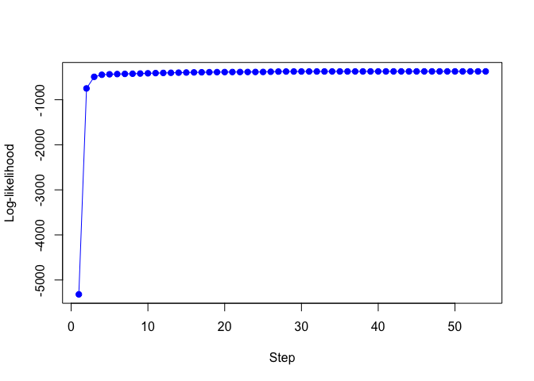
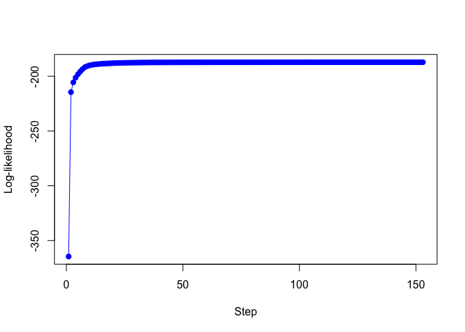

<!-- README.md is generated from README.Rmd. Please edit that file -->

# **RMoE**: LASSO Regularized Mixture of Experts Models

<!-- badges: start -->

<!-- badges: end -->

R Toolbox to run the algorithms and to produce the results presented in
the submitted paper:

*Estimation and Feature Selection in Mixtures of Generalized Linear
Experts Models.* Ref: arXiv:1907.06994, July, 2019 by Tuyen Huynh and
Faicel Chamroukhi. Please cite the paper and the toolbox when using the
code.

This package has three main functions:

  - *GaussRMoE*: To fit Gaussian Regularized Mixture-of-Experts;
  - *LogisticRMoE*: To fit Logistic Regularized Mixture-of-Experts;
  - *PoissonRMoE*: To fit Poisson Regularized Mixture-of-Experts.

# Installation

You can install **RMoE** package from
[GitHub](https://github.com/fchamroukhi/HDME) with:

``` r
# install.packages("devtools")
devtools::install_github("fchamroukhi/HDME")
```

To build *vignettes* for examples of usage, type the command below
instead:

``` r
# install.packages("devtools")
devtools::install_github("fchamroukhi/HDME", 
                         build_opts = c("--no-resave-data", "--no-manual"), 
                         build_vignettes = TRUE)
```

Use the following command to display vignettes:

``` r
browseVignettes("RMoE")
```

# Usage

``` r
library(RMoE)
```

<details>

<summary>Gaussian Regularized Mixture-of-Experts</summary>

``` r
# Application to a simulated data set

data("gaussian")
X <- as.matrix(gaussian[, -8])
y <- gaussian$V8

K <- 2 # Number of experts
Lambda <- 5
Gamma <- 5
opt <- FALSE # opt = FALSE: proximal Newton; opt = TRUE: proximal Newton-type

grmoe <- GaussRMoE(Xm = X, Ym = y, K = K, Lambda = Lambda, 
                   Gamma = Gamma, option = opt, verbose = TRUE)
#> EM - GRMoE: Iteration: 1 | log-likelihood: -1155.51
#> EM - GRMoE: Iteration: 2 | log-likelihood: -621.224174326092
#> EM - GRMoE: Iteration: 3 | log-likelihood: -603.229011444724
#> EM - GRMoE: Iteration: 4 | log-likelihood: -594.860880340466
#> EM - GRMoE: Iteration: 5 | log-likelihood: -580.927698600849
#> EM - GRMoE: Iteration: 6 | log-likelihood: -564.874476236119
#> EM - GRMoE: Iteration: 7 | log-likelihood: -553.197599868442
#> EM - GRMoE: Iteration: 8 | log-likelihood: -548.272707601689
#> EM - GRMoE: Iteration: 9 | log-likelihood: -546.909748540012
#> EM - GRMoE: Iteration: 10 | log-likelihood: -546.571811291028
#> EM - GRMoE: Iteration: 11 | log-likelihood: -546.479614064236
#> EM - GRMoE: Iteration: 12 | log-likelihood: -546.449896955669
#> EM - GRMoE: Iteration: 13 | log-likelihood: -546.43875997476
#> EM - GRMoE: Iteration: 14 | log-likelihood: -546.434056771332

grmoe$plot()
```


``` r
# Application to a real data set

data("housing")
X <- as.matrix(housing[, -15])
y <- housing$V15

K <- 2 # Number of experts
Lambda <- 42
Gamma <- 10
opt <- FALSE # opt = FALSE: proximal Newton; opt = TRUE: proximal Newton-type

grmoe <- GaussRMoE(Xm = X, Ym = y, K = K, Lambda = Lambda, 
                   Gamma = Gamma, option = opt, verbose = TRUE)
#> EM - GRMoE: Iteration: 1 | log-likelihood: -7067.11
#> EM - GRMoE: Iteration: 2 | log-likelihood: -719.221385722745
#> EM - GRMoE: Iteration: 3 | log-likelihood: -503.196441974336
#> EM - GRMoE: Iteration: 4 | log-likelihood: -445.311192948182
#> EM - GRMoE: Iteration: 5 | log-likelihood: -433.024840856279
#> EM - GRMoE: Iteration: 6 | log-likelihood: -427.614172947862
#> EM - GRMoE: Iteration: 7 | log-likelihood: -424.578345587325
#> EM - GRMoE: Iteration: 8 | log-likelihood: -422.797571553781
#> EM - GRMoE: Iteration: 9 | log-likelihood: -421.386365804177
#> EM - GRMoE: Iteration: 10 | log-likelihood: -419.583280567866
#> EM - GRMoE: Iteration: 11 | log-likelihood: -417.239507376031
#> EM - GRMoE: Iteration: 12 | log-likelihood: -414.402660322466
#> EM - GRMoE: Iteration: 13 | log-likelihood: -411.070434599337
#> EM - GRMoE: Iteration: 14 | log-likelihood: -407.912617432986
#> EM - GRMoE: Iteration: 15 | log-likelihood: -405.483613560578
#> EM - GRMoE: Iteration: 16 | log-likelihood: -403.588970351659
#> EM - GRMoE: Iteration: 17 | log-likelihood: -401.96983521777
#> EM - GRMoE: Iteration: 18 | log-likelihood: -400.969998044346
#> EM - GRMoE: Iteration: 19 | log-likelihood: -400.362950223254
#> EM - GRMoE: Iteration: 20 | log-likelihood: -400.008629118182
#> EM - GRMoE: Iteration: 21 | log-likelihood: -399.794594501288
#> EM - GRMoE: Iteration: 22 | log-likelihood: -399.661567464355
#> EM - GRMoE: Iteration: 23 | log-likelihood: -399.576962335363
#> EM - GRMoE: Iteration: 24 | log-likelihood: -399.521968063277
#> EM - GRMoE: Iteration: 25 | log-likelihood: -399.485358267125
#> EM - GRMoE: Iteration: 26 | log-likelihood: -399.460299879555
#> EM - GRMoE: Iteration: 27 | log-likelihood: -399.442615927541
#> EM - GRMoE: Iteration: 28 | log-likelihood: -399.429693840387
#> EM - GRMoE: Iteration: 29 | log-likelihood: -399.419912080514
#> EM - GRMoE: Iteration: 30 | log-likelihood: -399.412218391372
#> EM - GRMoE: Iteration: 31 | log-likelihood: -399.405960382817
#> EM - GRMoE: Iteration: 32 | log-likelihood: -399.400721817816
#> EM - GRMoE: Iteration: 33 | log-likelihood: -399.396228788248
#> EM - GRMoE: Iteration: 34 | log-likelihood: -399.39230228748

grmoe$plot()
```



</details>

<details>

<summary>Logistic Regularized Mixture-of-Experts</summary>

``` r
# Application to a simulated data set

data("logistic")
X <- as.matrix(logistic[, -8])
y <- logistic$V8

K <- 2 # Number of experts
Lambda <- 3
Gamma <- 3
opt <- FALSE # opt = FALSE: proximal Newton; opt = TRUE: proximal Newton-type

lrmoe <- LogisticRMoE(Xmat = X, Ymat = y, K = K, Lambda = Lambda, 
                   Gamma = Gamma, option = opt, verbose = TRUE)
#> EM - LRMoE: Iteration: 1 | log-likelihood: -374.03
#> EM - LRMoE: Iteration: 2 | log-likelihood: -213.644338492285
#> EM - LRMoE: Iteration: 3 | log-likelihood: -203.196028865909
#> EM - LRMoE: Iteration: 4 | log-likelihood: -199.150737881853
#> EM - LRMoE: Iteration: 5 | log-likelihood: -196.950917248357
#> EM - LRMoE: Iteration: 6 | log-likelihood: -195.469064051952
#> EM - LRMoE: Iteration: 7 | log-likelihood: -194.835517117442
#> EM - LRMoE: Iteration: 8 | log-likelihood: -194.463865509306
#> EM - LRMoE: Iteration: 9 | log-likelihood: -194.177587452604
#> EM - LRMoE: Iteration: 10 | log-likelihood: -193.981801836429
#> EM - LRMoE: Iteration: 11 | log-likelihood: -193.842686151156
#> EM - LRMoE: Iteration: 12 | log-likelihood: -193.710792528263
#> EM - LRMoE: Iteration: 13 | log-likelihood: -193.564246814994
#> EM - LRMoE: Iteration: 14 | log-likelihood: -193.400814152848
#> EM - LRMoE: Iteration: 15 | log-likelihood: -193.207635292356
#> EM - LRMoE: Iteration: 16 | log-likelihood: -192.966428431113
#> EM - LRMoE: Iteration: 17 | log-likelihood: -192.696118173197
#> EM - LRMoE: Iteration: 18 | log-likelihood: -192.357262888445
#> EM - LRMoE: Iteration: 19 | log-likelihood: -191.931532009497
#> EM - LRMoE: Iteration: 20 | log-likelihood: -191.413529759542
#> EM - LRMoE: Iteration: 21 | log-likelihood: -190.814247583914
#> EM - LRMoE: Iteration: 22 | log-likelihood: -190.159016369064
#> EM - LRMoE: Iteration: 23 | log-likelihood: -189.477149599
#> EM - LRMoE: Iteration: 24 | log-likelihood: -188.802822328238
#> EM - LRMoE: Iteration: 25 | log-likelihood: -188.289447689505
#> EM - LRMoE: Iteration: 26 | log-likelihood: -188.046053736273
#> EM - LRMoE: Iteration: 27 | log-likelihood: -187.914691868739
#> EM - LRMoE: Iteration: 28 | log-likelihood: -187.839953212107
#> EM - LRMoE: Iteration: 29 | log-likelihood: -187.794462450162
#> EM - LRMoE: Iteration: 30 | log-likelihood: -187.763947771616
#> EM - LRMoE: Iteration: 31 | log-likelihood: -187.741442953905
#> EM - LRMoE: Iteration: 32 | log-likelihood: -187.723595695797
#> EM - LRMoE: Iteration: 33 | log-likelihood: -187.708847855499
#> EM - LRMoE: Iteration: 34 | log-likelihood: -187.696386280812
#> EM - LRMoE: Iteration: 35 | log-likelihood: -187.685736817005
#> EM - LRMoE: Iteration: 36 | log-likelihood: -187.676632835248
#> EM - LRMoE: Iteration: 37 | log-likelihood: -187.668849773511
#> EM - LRMoE: Iteration: 38 | log-likelihood: -187.662201435356
#> EM - LRMoE: Iteration: 39 | log-likelihood: -187.656524576239
#> EM - LRMoE: Iteration: 40 | log-likelihood: -187.65167754275
#> EM - LRMoE: Iteration: 41 | log-likelihood: -187.647529735424
#> EM - LRMoE: Iteration: 42 | log-likelihood: -187.643972338039
#> EM - LRMoE: Iteration: 43 | log-likelihood: -187.64091200662
#> EM - LRMoE: Iteration: 44 | log-likelihood: -187.638267803976
#> EM - LRMoE: Iteration: 45 | log-likelihood: -187.635972860797
#> EM - LRMoE: Iteration: 46 | log-likelihood: -187.63397136624
#> EM - LRMoE: Iteration: 47 | log-likelihood: -187.632217008558
#> EM - LRMoE: Iteration: 48 | log-likelihood: -187.63067150983
#> EM - LRMoE: Iteration: 49 | log-likelihood: -187.629303301699
#> EM - LRMoE: Iteration: 50 | log-likelihood: -187.628087114374
#> EM - LRMoE: Iteration: 51 | log-likelihood: -187.627001114118
#> EM - LRMoE: Iteration: 52 | log-likelihood: -187.62602688453
#> EM - LRMoE: Iteration: 53 | log-likelihood: -187.625149760474
#> EM - LRMoE: Iteration: 54 | log-likelihood: -187.624357502918
#> EM - LRMoE: Iteration: 55 | log-likelihood: -187.623639840816
#> EM - LRMoE: Iteration: 56 | log-likelihood: -187.622988103195
#> EM - LRMoE: Iteration: 57 | log-likelihood: -187.622394922116
#> EM - LRMoE: Iteration: 58 | log-likelihood: -187.621853994202
#> EM - LRMoE: Iteration: 59 | log-likelihood: -187.621359889731
#> EM - LRMoE: Iteration: 60 | log-likelihood: -187.620908249609
#> EM - LRMoE: Iteration: 61 | log-likelihood: -187.620494521821
#> EM - LRMoE: Iteration: 62 | log-likelihood: -187.620115940507
#> EM - LRMoE: Iteration: 63 | log-likelihood: -187.619768339332
#> EM - LRMoE: Iteration: 64 | log-likelihood: -187.619448921132
#> EM - LRMoE: Iteration: 65 | log-likelihood: -187.619155200994
#> EM - LRMoE: Iteration: 66 | log-likelihood: -187.618884952005
#> EM - LRMoE: Iteration: 67 | log-likelihood: -187.618636169118
#> EM - LRMoE: Iteration: 68 | log-likelihood: -187.618407040883
#> EM - LRMoE: Iteration: 69 | log-likelihood: -187.618195926414
#> EM - LRMoE: Iteration: 70 | log-likelihood: -187.618001336072
#> EM - LRMoE: Iteration: 71 | log-likelihood: -187.61782191498
#> EM - LRMoE: Iteration: 72 | log-likelihood: -187.617656428806
#> EM - LRMoE: Iteration: 73 | log-likelihood: -187.617503751422
#> EM - LRMoE: Iteration: 74 | log-likelihood: -187.617362854103
#> EM - LRMoE: Iteration: 75 | log-likelihood: -187.617232796052
#> EM - LRMoE: Iteration: 76 | log-likelihood: -187.617113054544
#> EM - LRMoE: Iteration: 77 | log-likelihood: -187.617002455775
#> EM - LRMoE: Iteration: 78 | log-likelihood: -187.61690027636
#> EM - LRMoE: Iteration: 79 | log-likelihood: -187.616805857744

lrmoe$plot()
```



</details>

<details>

<summary>Poisson Regularized Mixture-of-Experts</summary>

``` r
# Application to a simulated data set

data("poisson")
X <- as.matrix(poisson[, -8])
y <- poisson$V8

K <- 2 # Number of experts
Lambda <- 20
Gamma <- 10
opt <- FALSE # opt = FALSE: proximal Newton; opt = TRUE: proximal Newton-type

prmoe <- PoissonRMoE(Xmat = X, Ymat = y, K = K, Lambda = Lambda, 
                   Gamma = Gamma, option = opt, verbose = TRUE)
#> EM - PRMoE: Iteration: 1 | log-likelihood: -2242.14
#> EM - LRMoE: Iteration: 2 | log-likelihood: -916.521301064778
#> EM - LRMoE: Iteration: 3 | log-likelihood: -814.165631840007
#> EM - LRMoE: Iteration: 4 | log-likelihood: -769.815579942242
#> EM - LRMoE: Iteration: 5 | log-likelihood: -730.995630086905
#> EM - LRMoE: Iteration: 6 | log-likelihood: -710.393602743601
#> EM - LRMoE: Iteration: 7 | log-likelihood: -680.82764077104
#> EM - LRMoE: Iteration: 8 | log-likelihood: -625.765129743735
#> EM - LRMoE: Iteration: 9 | log-likelihood: -588.700574868316
#> EM - LRMoE: Iteration: 10 | log-likelihood: -586.035092262835
#> EM - LRMoE: Iteration: 11 | log-likelihood: -585.749365813701
#> EM - LRMoE: Iteration: 12 | log-likelihood: -585.700526095004
#> EM - LRMoE: Iteration: 13 | log-likelihood: -585.687643974036
#> EM - LRMoE: Iteration: 14 | log-likelihood: -585.683562454663

prmoe$plot()
```


``` r
# Application to a real data set

data("cleveland")
X <- as.matrix(cleveland[, -15])
y <- cleveland$V15

K <- 2 # Number of experts
Lambda <- 10
Gamma <- 4
opt <- FALSE # opt = FALSE: proximal Newton; opt = TRUE: proximal Newton-type

prmoe <- PoissonRMoE(Xmat = X, Ymat = y, K = K, Lambda = Lambda, 
                   Gamma = Gamma, option = opt, verbose = TRUE)
#> EM - PRMoE: Iteration: 1 | log-likelihood: -521.05
#> EM - LRMoE: Iteration: 2 | log-likelihood: -331.837050336036
#> EM - LRMoE: Iteration: 3 | log-likelihood: -327.783515196425
#> EM - LRMoE: Iteration: 4 | log-likelihood: -327.204336838067
#> EM - LRMoE: Iteration: 5 | log-likelihood: -326.784150694543
#> EM - LRMoE: Iteration: 6 | log-likelihood: -326.362684044888
#> EM - LRMoE: Iteration: 7 | log-likelihood: -326.036067753669
#> EM - LRMoE: Iteration: 8 | log-likelihood: -325.78234930731
#> EM - LRMoE: Iteration: 9 | log-likelihood: -325.601473335354
#> EM - LRMoE: Iteration: 10 | log-likelihood: -325.45017338474
#> EM - LRMoE: Iteration: 11 | log-likelihood: -325.307803272123
#> EM - LRMoE: Iteration: 12 | log-likelihood: -325.162339461146
#> EM - LRMoE: Iteration: 13 | log-likelihood: -325.005212740833
#> EM - LRMoE: Iteration: 14 | log-likelihood: -324.829286687692
#> EM - LRMoE: Iteration: 15 | log-likelihood: -324.642904133704
#> EM - LRMoE: Iteration: 16 | log-likelihood: -324.514370932739
#> EM - LRMoE: Iteration: 17 | log-likelihood: -324.38876632741
#> EM - LRMoE: Iteration: 18 | log-likelihood: -324.259551691854
#> EM - LRMoE: Iteration: 19 | log-likelihood: -324.127705073223
#> EM - LRMoE: Iteration: 20 | log-likelihood: -323.989767059867
#> EM - LRMoE: Iteration: 21 | log-likelihood: -323.84359805933
#> EM - LRMoE: Iteration: 22 | log-likelihood: -323.686542859925
#> EM - LRMoE: Iteration: 23 | log-likelihood: -323.516229646111
#> EM - LRMoE: Iteration: 24 | log-likelihood: -323.33451974233
#> EM - LRMoE: Iteration: 25 | log-likelihood: -323.144190332138
#> EM - LRMoE: Iteration: 26 | log-likelihood: -322.948115002284
#> EM - LRMoE: Iteration: 27 | log-likelihood: -322.744541218718
#> EM - LRMoE: Iteration: 28 | log-likelihood: -322.531405233005
#> EM - LRMoE: Iteration: 29 | log-likelihood: -322.314681567712
#> EM - LRMoE: Iteration: 30 | log-likelihood: -322.092845379203
#> EM - LRMoE: Iteration: 31 | log-likelihood: -321.860243953418
#> EM - LRMoE: Iteration: 32 | log-likelihood: -321.612573425113
#> EM - LRMoE: Iteration: 33 | log-likelihood: -321.344081052354
#> EM - LRMoE: Iteration: 34 | log-likelihood: -321.046141511173
#> EM - LRMoE: Iteration: 35 | log-likelihood: -320.720879537657
#> EM - LRMoE: Iteration: 36 | log-likelihood: -320.349726206264
#> EM - LRMoE: Iteration: 37 | log-likelihood: -319.915169722874
#> EM - LRMoE: Iteration: 38 | log-likelihood: -319.405618342887
#> EM - LRMoE: Iteration: 39 | log-likelihood: -318.80096039158
#> EM - LRMoE: Iteration: 40 | log-likelihood: -318.08562504418
#> EM - LRMoE: Iteration: 41 | log-likelihood: -317.251188035117
#> EM - LRMoE: Iteration: 42 | log-likelihood: -316.303167275176
#> EM - LRMoE: Iteration: 43 | log-likelihood: -315.26704401019
#> EM - LRMoE: Iteration: 44 | log-likelihood: -314.307833619488
#> EM - LRMoE: Iteration: 45 | log-likelihood: -313.495989681827
#> EM - LRMoE: Iteration: 46 | log-likelihood: -312.911165871197
#> EM - LRMoE: Iteration: 47 | log-likelihood: -312.560157386247
#> EM - LRMoE: Iteration: 48 | log-likelihood: -312.356764827082
#> EM - LRMoE: Iteration: 49 | log-likelihood: -312.241931872735
#> EM - LRMoE: Iteration: 50 | log-likelihood: -312.175135081871
#> EM - LRMoE: Iteration: 51 | log-likelihood: -312.133104696659
#> EM - LRMoE: Iteration: 52 | log-likelihood: -312.103919027336
#> EM - LRMoE: Iteration: 53 | log-likelihood: -312.08189103151
#> EM - LRMoE: Iteration: 54 | log-likelihood: -312.064270104854
#> EM - LRMoE: Iteration: 55 | log-likelihood: -312.049721953149
#> EM - LRMoE: Iteration: 56 | log-likelihood: -312.037515351066
#> EM - LRMoE: Iteration: 57 | log-likelihood: -312.027198650303
#> EM - LRMoE: Iteration: 58 | log-likelihood: -312.01845722995
#> EM - LRMoE: Iteration: 59 | log-likelihood: -312.011039468387
#> EM - LRMoE: Iteration: 60 | log-likelihood: -312.004743556946
#> EM - LRMoE: Iteration: 61 | log-likelihood: -311.999399383079
#> EM - LRMoE: Iteration: 62 | log-likelihood: -311.994862034125
#> EM - LRMoE: Iteration: 63 | log-likelihood: -311.991007796895
#> EM - LRMoE: Iteration: 64 | log-likelihood: -311.987731224391
#> EM - LRMoE: Iteration: 65 | log-likelihood: -311.984942708005

prmoe$plot()
```


</details>
